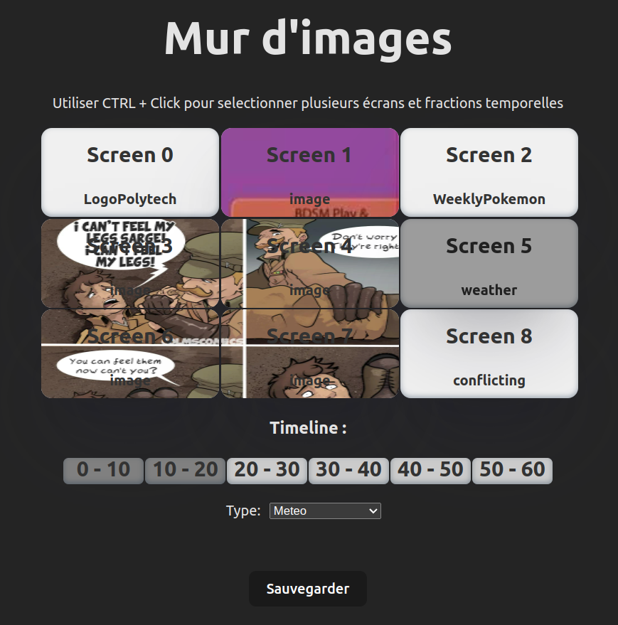
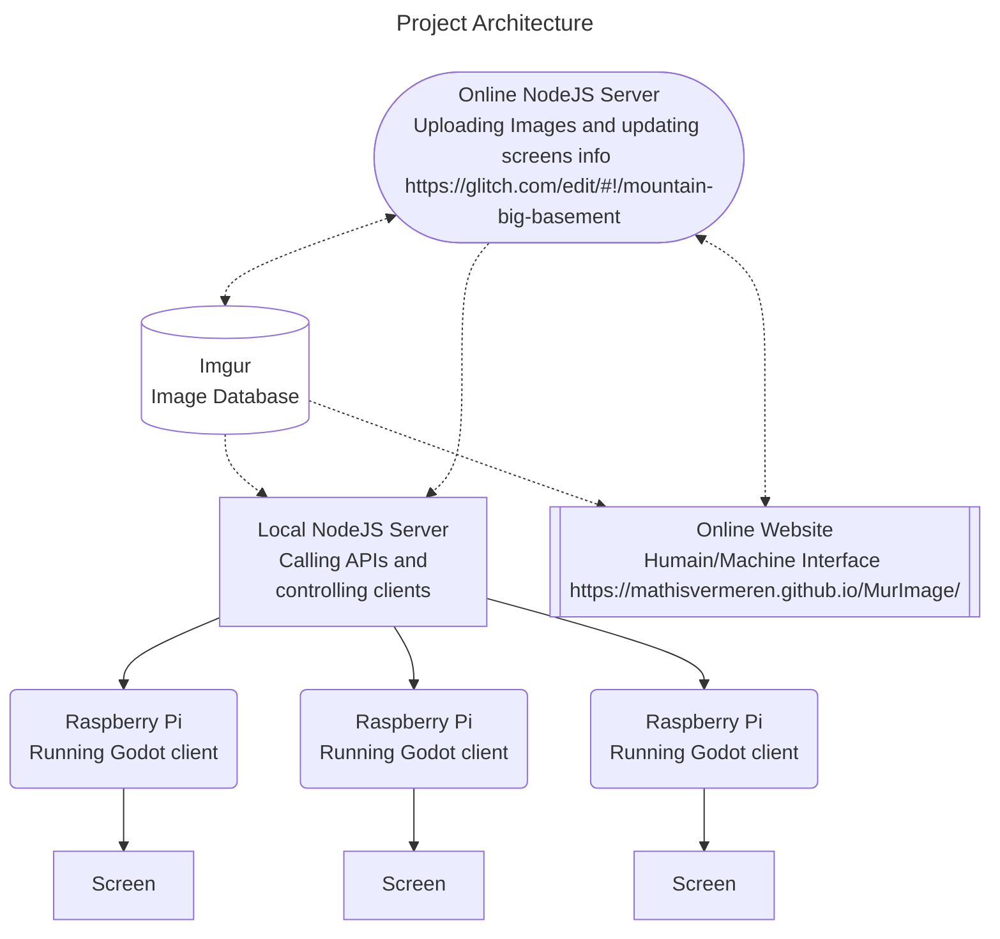

# Architecture du projet : 





Des clients tournent pour chaques écran. Ils sont codés en Godot.
Un server local Node.JS est connecté aux clients via un websocket et à internet.
Les données à afficher sont stockées soit sur le repo github sous data/content.json soit sur le serveur distant NodeJS : https://mountain-big-basement.glitch.me/content (hebergé sur glitch gratuitement, il faut attendre une dizaine de secondes pour qu'il se lance et reste allumé 12h).
Le serveur traduit ensuite ce premier JSON en allant chercher les données à jour de chaque API d'internet (météo, images ...) et renvoie un JSON au client avec les informations à afficher.
Voir par exemple [Meteo](type_database/Meteo.md).


Les json suit cette structure : 
```json
{
	"screen_id": /* integer */,
	"type": /* weather, image, datetime, etc... */
	"parametres": {
		/* parametres de chaque scène */
	}
},  
```

On peut modifier les données à afficher grâce au site web : https://mathisvermeren.github.io/MurImage/

## Site Web  
#### Backend 
Le backend tourne sur glitch.me à l'addresse (https://mountain-big-basement.glitch.me/).
Le serveur s'éteint tout les 8h, il faut alors attendre une dizaine de secondes pour qu'il se relance.
Le backend a trois routes : 
 * GET /content : qui renvoie content.json, les informations à afficher à chaque écran et pour chaque timeline. 
 * POST /content : qui permet d'enregistrer un nouveau content.json.
 * POST /uploadImgur : qui enregistre une image envoyée, l'envoie ensuite à l'API du site de téléchargement d'images Imgur avec un token d'identification, puis renvoie l'URL de l'image au client et supprime l'image stockée (car le serveur gratuit a un stockage très limité).  

 Ce serveur est codé en NodeJS et ExpressJS et utilise quelques libraries comme :
**ExpressJS** : Un framework web minimaliste pour Node.js, simplifiant la création d'applications web en utilisant des concepts tels que les routes et les middlewares.
**dotenv** : Une bibliothèque Node.js permettant de charger des variables d'environnement depuis un fichier `.env`, permettant de séparer les tokens du reste du code.
**cors** : Un middleware Express facilitant la gestion des politiques CORS (Cross-Origin Resource Sharing) pour autoriser les requêtes HTTP depuis des domaines différents.
**axios** : Une bibliothèque HTTP basée sur les promesses pour effectuer des requêtes HTTP depuis le navigateur ou Node.js.
**fs** : Le module système de fichiers intégré à Node.js, permettant la manipulation des fichiers, la lecture et l'écriture, ainsi que la gestion des répertoires.
**path** : Un module Node.js fournissant des utilitaires pour travailler avec les chemins de fichiers et de répertoires, offrant des fonctionnalités pour normaliser et résoudre les chemins.
**body-parser** : Un middleware Express permettant de traiter le corps des requêtes HTTP, notamment l'extraction des données des formulaires ou des charges utiles JSON.
**mime-types** : Une bibliothèque permettant de déterminer le type MIME d'un fichier à partir de son extension, utile lors du traitement des fichiers dans des applications web.
**multer** : Un middleware Express spécialisé dans le traitement des données de formulaire de type `multipart/form-data`, souvent utilisé pour gérer les téléchargements de fichiers dans les applications web.

#### Frontend 
Le frontend est hebergé gratuitement grâce à github-pages à l'addresse https://mathisvermeren.github.io/MurImage/. Il est réalisé avec le framework ReactJS et deployé avec viteJS. La fonctionnalité principale de celui ci est de pouvoir sélectionner plusieurs écrans et plusieurs crénaux temporels en même temps, pour par exemple mettre une image coupées en plusieurs écrans ou pour fixer un écran pendant plus de 10s en 1 clique. Il a été réalisé en une quarantaine d'heure.

# Structure Json pour chaque scène : (A Compléter)
(A Compléter pour chaque type)

 * [Image](type_database/Image.md)
 * [Meteo](type_database/Meteo.md)
 * [RATP](type_database/RATP.md)
 * [PlanningEvent](type_database/PlanningEvent.md)
 * [ResaSalles](type_database/ResaSalles.md)
 * [Annonce](type_database/Annonce.md)
 * [WeeklyPokemon](type_database/WeeklyPokemon.md)
 * [LogoPolytech](type_database/LogoPolytech.md)
 * Ajouter les types suivants : 
 * heure
 * logo
 * modulable...
 * calendrier vacances
 * news
